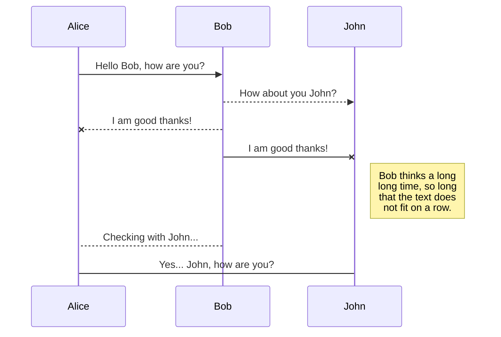
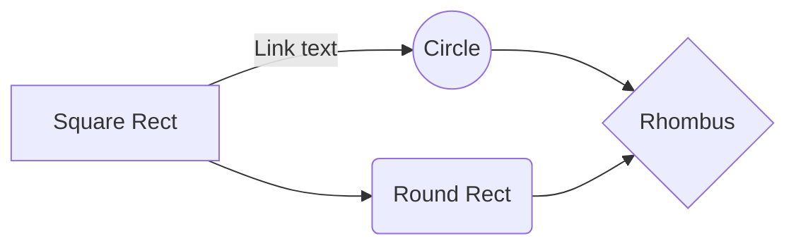

# CONVENTION D'ECRITURE

[lien documentation markdown](https://docs.framasoft.org/fr/grav/markdown.html)

## PARAGRAPHES
On écrit normalement. Une ligne sautée correspond à une ligne sautée à l'affichage

## STYLES DE TEXTE
* Ce qui est entre 2 "**" sera en gras:
>blablabla **je suis en gras** blablabla

* Ce qui est entre des "_" sera en italique:
>blablabla _je suis en italique_ blablabla

* Ce qui est entre 2 "**" et 1 "_" sera en gras-italique:
> blabla **_je suis en gras-italique_** blabla

* Ce qui est entre 2 "~ ~" sera  barré
> blabla ~~je suis barré~~ blabla

## TITRES
	#<espace>			-> pour le titre principal
	##<espace>			-> titre 1
	###<espace>			-> titre 2
	####<espace>		-> titre 3
	...

## LISTES

* <espace><nom>		-> pour les listes à puces
			* chocolat
			* fromage
			* salade

* <espace><nom>
	* <4 espaces><nom>	-> pour les listes à puces imbriquées

_REMARQUES_:
##### exemple de liste
* normal
 * <espace>normal
   * <espace*3>normal
      * <espace*6>normal
 * <espace>normal
* normal
 * <espace>normal
 * <espace>normal

##### exemple de liste
* normal
 * <espace>"* "normal
   * <espace><espace>normal
 * <espace>normal
* normal
      * <espace*6>normal			-> est encadré
 * <espace>

* <espace><chiffre.> normal		-> pour les listes numérotées

_REMARQUES_:
			- pas de liste imbriquées numérotées
			- <espace*6><chiffre;> normal				-> est encadré

* cases à cocher

- [ ] Case non cochée
- [x] Case cochée

## TABLEAU

| Titre 1       |     Titre 2     |        Titre 3 |
| :------------ | :-------------: | -------------: |
| Colonne       |     Colonne     |        Colonne |
| Alignée à     |   Alignée au    |      Alignée à |
| Gauche        |     Centre      |         Droite |

## CITATIONS

	> <normal>			-> crée une citation: fait un alinéa avec une barre verticale sur toute la hauteur de cette citaion (prend en compte ce qui est en dessous si pas de ligne sautée)

_REMARQUE_: on peut imbriquer des citations dans les citations
>parent
>>enfant
>>>petit enfant


## CODE SOURCE

<espace>*4 || ou tabulation> code
		ex:
		Voici un code en C :

	int main()							-> avant int il y a 4 espaces ou une tab (idem pour tout le code)
    {
        printf("Hello world!\n");
        return 0;
    }

ou

```terminal
exemple_de
code
sur plusieurs
lignes
```

## CODE SOURCE DANS 1 LIGNE
`<code source>`			-> on entoure le code de `


## LIENS
[nomAAfficher](<lien>)
						[google](https://google.fr)

## MAILS
[nomMail](<email>)			-> comme pour lien							

## IMAGES
			-> ne pas oublier le "!"


## BARRE DE SEPARATION
--------------------------------						-> saute une ligne
********************************				-> saute plusieurs lignes

## DIAGRAMMES
### KaTeX
Afficher une expression mathematique LaTeX en utilisant [KaTeX](https://khan.github.io/KaTeX/):
The *Gamma function* satisfying $\Gamma(n) = (n-1)!\quad\forall n\in\mathbb N$ is via the Euler integral

$$
\Gamma(z) = \int_0^\infty t^{z-1}e^{-t}dt\,.
$$

> You can find more information about **LaTeX** mathematical expressions [here](http://meta.math.stackexchange.com/questions/5020/mathjax-basic-tutorial-and-quick-reference).


### UML diagrams
Afficher un diagramme UML en utilisant [Mermaid](https://mermaidjs.github.io/)



And this will produce a flow chart:


